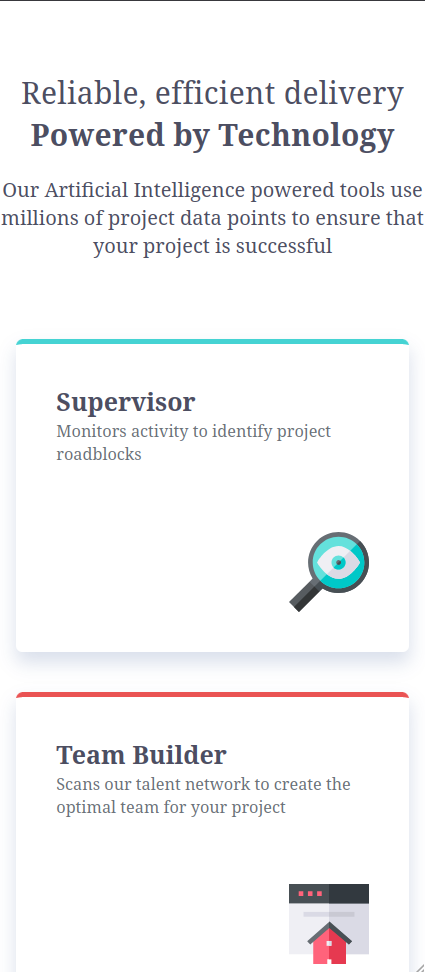
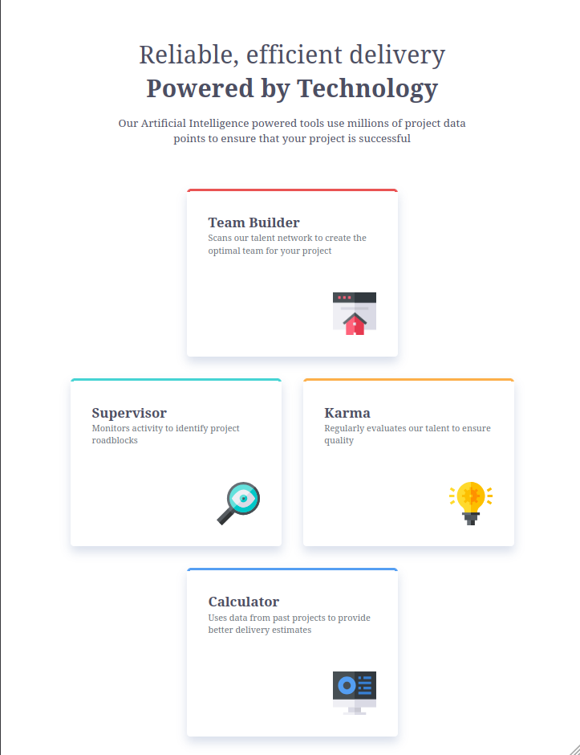
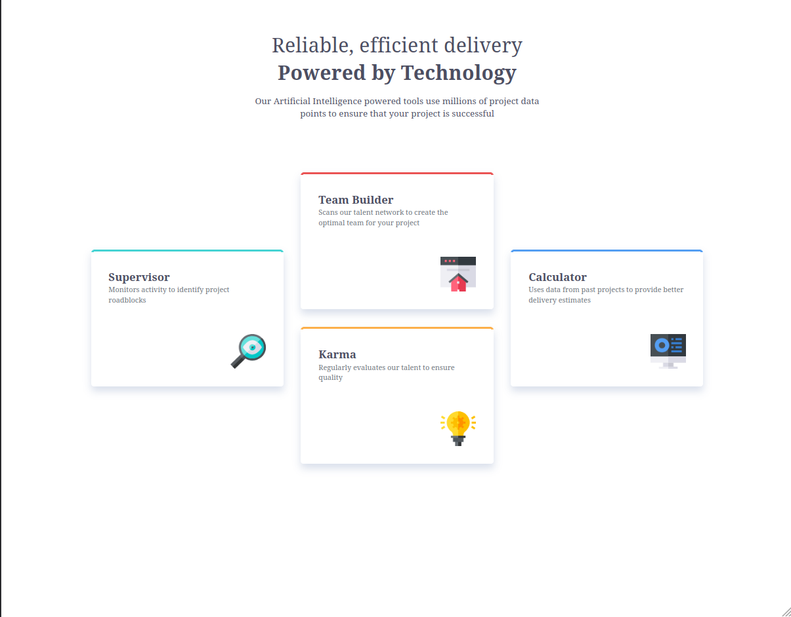

# Frontend Mentor - Four card feature section solution

This is a solution to the [Four card feature section challenge on Frontend Mentor](https://www.frontendmentor.io/challenges/four-card-feature-section-weK1eFYK). Frontend Mentor challenges help you improve your coding skills by building realistic projects. 

## Table of contents

- [Overview](#overview)
  - [The challenge](#the-challenge)
  - [Screenshot](#screenshot)
  - [Links](#links)
- [My process](#my-process)
  - [Built with](#built-with)
  - [What I learned](#what-i-learned)
  - [Continued development](#continued-development)
  - [Useful resources](#useful-resources)
  - [AI Collaboration](#ai-collaboration)
- [Author](#author)

## Overview

### The challenge

Users should be able to:

- View the optimal layout for the site depending on their device's screen size

### Screenshot





### Links

- Solution URL: [https://github.com/capellofabio/fem-four-card-feature-section](https://github.com/capellofabio/fem-four-card-feature-section)
- Live Site URL: [https://capellofabio.github.io/fem-four-card-feature-section/](https://capellofabio.github.io/fem-four-card-feature-section/)

## My process

### Built with

- Semantic HTML5 markup
- CSS custom properties
- BEM methodology
- Flexbox
- CSS Grid
- Mobile-first workflow

### What I learned

In this project, I've learned how to use the BEM methodology, I've highly improved my understanding of CSS Grid. I also learned the "ch" unit, extremely useful for limiting paragraph length. Most importantly, perhaps, I've improved my understanding of variable naming for easier maintainability and flexibility for the possibility of future design changes.

```html
<div class="card card--supervisor">
    <h2 class="card__title">Supervisor</h2>
    <p class="card__description">Monitors activity to identify project roadblocks</p>
    
</div>
```
```css
:root {
    /* Defines the global colors */
    --clr-grey-500: hsl(234, 12%, 34%); /* default color */
    --clr-grey-400: hsl(212, 6%, 44%);
    --clr-red: hsl(0, 78%, 62%);
    --clr-cyan: hsl(180, 62%, 55%);
    --clr-blue: hsl(212, 86%, 64%);
    --clr-orange: hsl(34, 97%, 64%);

    /* Defines variables based on functionality */
    --card-supervisor-border: var(--clr-cyan);
    --card-team-builder-border: var(--clr-red);
    --card-karma-border: var(--clr-orange);
    --card-calculator-border: var(--clr-blue);
    --card-paragraph: var(--clr-grey-400);
}
```
```css
.cards-container {
    grid-template-columns: repeat(3, 350px);
    grid-template-rows: repeat(4, 125px);
    gap: 2rem;
}
```

### Continued development

I want to continue deepening my understanding of CSS Grid and the BEM methodology. I'd also love explore new CSS tricks and implementations.
CSS Grid, in particular, still feels a little "alien" to me, but I feel like I'm getting closer to that "click" that makes it make sense.

### Useful resources

- [BEM website](https://getbem.com/) - The official BEM website helped me understand the different CSS methodologies and the reasoning behind them.
- [DECAF blog](https://blog.decaf.de/2015/06/24/why-bem-in-a-nutshell/) - This helped me better understand how BEM nomenclature works.
- [CSS Grid Generator](https://cssgridgenerator.io/) - This is an amazing tool that helps me plan CSS Grid implementation in a very interactive way.

### AI Collaboration

- Google Gemini
- I've used Gemini to get feedback on short snippets of code and to find properties I couldn't remember from the top of my head.
- It helped me explore some fun alternatives (after I'd solved by myself) and essentially cut what would've been dozens of minutes looking through documentation and stackoverflow to find the property I was looking for into a simple query.

## Author

- Website - [Add your name here](https://www.your-site.com)
- Frontend Mentor - [@yourusername](https://www.frontendmentor.io/profile/yourusername)
- Twitter - [@yourusername](https://www.twitter.com/capellofabio)
